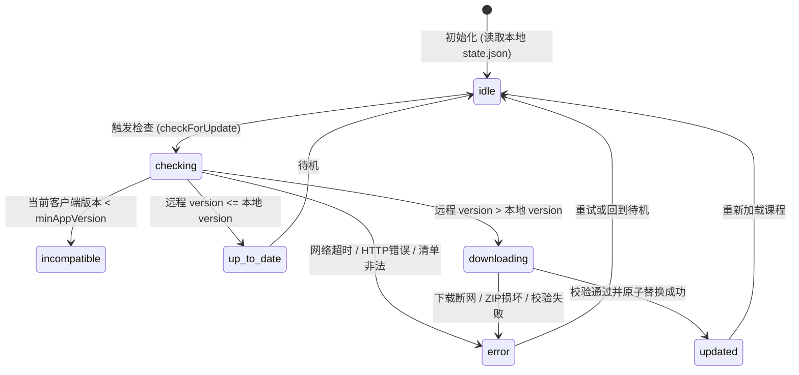

# RoboHorse Studio 远程课程更新机制

更新日期：2026-09-27  
适用发行版：`mcu-foundations`（CH32 单片机入门版）、`ti-mspm0-foundations`（TI MSPM0 教学版）  
核心源码参考：[`src/main/services/course-update-service.ts`](../../src/main/services/course-update-service.ts)、[`src/main/services/course-resolver.ts`](../../src/main/services/course-resolver.ts)

---

## 1. 系统概述

RoboHorse Studio 提供轻量级远程课程更新机制。教师与课程开发者只需在远程 Gitee 仓库发布更新后的课程包，学生端即可在不重新安装或升级上位机软件的前提下获取最新教学内容与课次实验。

课程更新具有以下核心特性：
- **静默后台检查与手动检查并行**：应用启动后按需后台检查，用户也可在课程中心手动点击检查；
- **多发行版独立管理**：CH32V203 与 TI MSPM0 具备完全隔离的缓存目录、版本号及课程包；
- **三层回退保障**：更新失败或无网络时，自动使用本地已有缓存或安装包内置课程，绝不阻塞学生使用；
- **强事务原子替换**：下载 -> 结构校验 -> 发行版匹配 -> 原子目录替换，出现异常立即回滚。

---

## 2. 存储与解析分层架构

课程解析器（`CourseResolver`）采用三层查找策略，严格按优先级生效：

```text
               ┌─────────────────────────────────────────────────────┐
               │         客户端课程解析器 (CourseResolver)            │
               └──────────────────────────┬──────────────────────────┘
                                          │
                         1. 检查是否存在有效的远程缓存?
                                     /         \
                                    /           \
                                  Yes            No
                                  /                \
                                 ▼                  ▼
┌──────────────────────────────────────────────┐  ┌──────────────────────────────────────────┐
│             本地用户缓存层                   │  │             安装包内置层                 │
│  app.getPath('userData')/courses/            │  │  resources/courses/<editionId>/          │
│    <editionId>/                              │  │  - catalog.json                         │
│      current/ (优先加载)                     │  │  - <courseId>/                          │
│      state.json (记录当前缓存版本)           │  │  (安装包自带，离线可用，基线兜底)       │
└──────────────────────────────────────────────┘  └──────────────────────────────────────────┘
```

### 目录结构与隔离机制

课程缓存不存放在单一全局目录，而是存放在各自发行版的 `userData` 目录下（`app.getPath('userData')/courses/`）。因各 Edition 的 `userDataDirectoryName` 不同，天然实现物理隔离：
- CH32 单片机入门版：`%APPDATA%\RobotDogStudio-MCU\courses\mcu-foundations`
- TI MSPM0 教学版：`%APPDATA%\RobotDogStudio-TI-MSPM0\courses\ti-mspm0-foundations`

单个发行版下的内部目录结构：

```text
app.getPath('userData')/courses/<editionId>/
├─ state.json               # 记录当前已应用的远程版本: { "version": 10, "updatedAt": "..." }
├─ current/                 # 当前生效的最新课程解压目录（含 catalog.json、courses...）
├─ backup/                  # 更新升级前的备份（替换或重载失败时自动回滚，成功后清除）
└─ temp/                    # 临时下载目录（下载 course.zip 与提取检验）
```

---

## 3. 远程清单与更新协议

### 3.1 更新源地址

默认通过 HTTPS 访问 Gitee 仓库的原始文件：

```text
https://gitee.com/Cidervinegar/robohorse-courses/raw/master/update.json
```

可以通过选项 `updateUrl` 或环境变量动态配置，便于内网私有镜像或开发测试。

### 3.2 Manifest 规范 (Schema Version 2)

远程 `update.json` 支持多发行版配置：

```json
{
  "schemaVersion": 2,
  "editions": {
    "mcu-foundations": {
      "version": 10,
      "minAppVersion": "0.1.0",
      "url": "https://gitee.com/Cidervinegar/robohorse-courses/raw/master/courses/mcu-foundations/course.zip"
    },
    "ti-mspm0-foundations": {
      "version": 1,
      "minAppVersion": "0.1.0",
      "url": "https://gitee.com/Cidervinegar/robohorse-courses/raw/master/courses/ti-mspm0-foundations/course.zip"
    }
  }
}
```

字段约束：
- `schemaVersion`：必须为 `2`（同时向后兼容 schema v1 的单课程结构）；
- `version`：课程递增正整数。只有当 `remoteVersion > localVersion` 时才会触发更新；
- `minAppVersion`：（可选）语义化版本号。若当前上位机版本低于此要求，更新状态转为 `incompatible`，提示学生升级软件，不会强行下载导致语法或解析错误；
- `url`：对应发行版课程 ZIP 压缩包的直链下载地址。

---

## 4. 更新生命周期与安全状态机



### 状态对象 (`CourseUpdateStatus`)

IPC 接口与前端界面均消费统一的状态对象：

```typescript
export interface CourseUpdateStatus {
  kind: 'idle' | 'checking' | 'downloading' | 'updated' | 'up-to-date' | 'incompatible' | 'error'
  message: string
  currentVersion: number
  remoteVersion?: number
  minAppVersion?: string
  lastCheckedAt?: string
  error?: string
}
```

---

## 5. 安全校验与强事务原子回滚

下载的课程内容直接被客户端解析和展示，因此 `CourseUpdateService` 实施了严格的安全防御与完整的原子更新事务：

1. **有界超时保护**：Manifest 请求限时 10 秒，ZIP 下载限时 60 秒，避免无限期挂起网络连接。
2. **下载完整性检查**：检查下载 Buffer 非空且大于 0 字节。
3. **高效安全解压**：解压至 `temp/extracted` 临时目录，不直接触碰生效目录。解压优先调用系统原生 `tar.exe`（`tar.exe -xf <zipPath> -C <destDir>`），若执行失败自动 fallback 回退到 PowerShell `Expand-Archive`。
4. **合法性深层校验**：
   - 必须包含合法的 `catalog.json`；
   - `catalog.json` 的 `schemaVersion` 必须为 `1`；
   - `courses` 列表必须非空；
   - **发行版匹配校验**：`ti-mspm0-foundations` 的课程必须以 `ti-mspm0` 开头；`mcu-foundations` 的课程必须以 `ch32` 开头，杜绝误配导致的跨平台课程污染。
5. **完整可逆的事务原子更新机制**：
   ```text
   ① 记录现有 state.json 内容（若存在）
   ② 现有 current/ -> backup/
   ③ temp/extracted/ -> current/
   ④ 写入并核实新的 state.json
   ⑤ 触发课程重新载入回调 (onCourseUpdated)
   ⑥ 全部成功后：彻底清理 backup/ 与 temp/
   ```
   **失败自动回滚规则**：如果在 ③、④、⑤ 任一步骤抛出任何异常：
   - 自动移除损坏或不完整的新 `current/`；
   - 将 `backup/` 自动还原为 `current/`；
   - 恢复原有的 `state.json` 文件内容（若原本不存在则安全清理）；
   - 将状态标记为 `error` 并返回；
   - **结果保证**：绝不留下“文件已替换但 state.json 未写”或“写了新版本号但课程无法加载”的不一致半衰状态。

---

## 6. 与工作区及学习进度版本的关系

远程更新课程时，必须理解系统内部的版本体系：

| 版本概念 | 作用层级 | 说明 |
| --- | --- | --- |
| **`remoteData.version`** | 远程分发层 | 对应 `update.json` 中的整数，控制客户端是否拉取新 ZIP |
| **`course.json` 的 `contentVersion`** | 课程内容层 | 课程本身的全局版本号（如 10），用于计算课程内容摘要指纹 |
| **`learningCompatibleFrom`** | 讲义学习进度 | 声明旧版本讲义的顶层 H2 Section ID 是否仍可继承阅读完成状态 |
| **`progressCompatibleFrom`** | 实验任务进度 | 声明旧版本实验任务的步骤 ID、检查条件是否可兼容旧练习工作区 |

> [!IMPORTANT]
> 远程更新的是课程知识库与课次模板定义。对于学生已经在进行中的练习工作区（Workspace），工作区保持已有 Git 历史和文件状态不变；新创建的练习工作区将基于更新后的课次模板与要求初始化。

---

## 7. 开发者发布流程

当需要向远程仓库发布新课程或修改课次时，请遵循以下规范步骤：

### 步骤一：在上位机仓库完成本地开发与门禁验证
1. 在 `resources/courses/<editionId>/` 修改课程或讲义；
2. 运行本地验证：
   ```powershell
   corepack pnpm courses:validate
   corepack pnpm test
   ```
3. 确认所有课次 manifest、讲义 markdown 规范、硬件验证标记均无误。

### 步骤二：准备课程压缩包
将目标发行版的课程内容打包为 `course.zip`（确保 `catalog.json` 位于压缩包顶层或第一层子目录下）：
```powershell
# 例如将 mcu-foundations 打包
Compress-Archive -Path "resources/courses/mcu-foundations/*" -DestinationPath "d:/RobotDog/robohorse-courses/courses/mcu-foundations/course.zip" -Force
```

### 步骤三：更新远程仓库与清单
在本地课程仓库 `D:\RobotDog\robohorse-courses` 中：
1. 递增 `update.json` 中对应发行版的 `version`；
2. 如使用了新客户端特性，更新 `minAppVersion`；
3. 提交并推送至 Gitee：
   ```powershell
   git add .
   git commit -m "feat(courses): release mcu-foundations version 11"
   git push origin master
   ```

### 步骤四：客户端验证
打开 RoboHorse Studio 对应版本（如 `dev:mcu`），进入课程中心点击“检查更新”，验证能否成功发现版本、下载解压、无缝载入新课。
