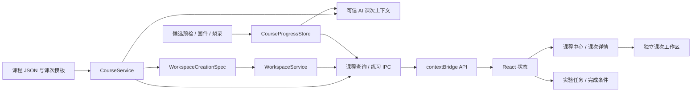

# RobotDog Studio 单片机课程框架架构说明

更新日期：2026-08-07

状态：课程框架与代码优先工作台首个可用版本

关联计划：[单片机入门版课程框架详细实施计划](./mcu-course-framework-implementation-plan.md) · [代码优先工作台改造计划](./mcu-code-first-workbench-redesign-plan.md) · [课程讲义系统实施计划](./mcu-lecture-system-implementation-plan.md)

课程知识层采用 Main 单一解析的 Lecture v1：课程目录和 Lesson 不预载正文，指定课次按需解析为 Safe Lecture Model，再供 Renderer 与 AI 共同消费。Renderer 不接收原始 Markdown；图片通过文档摘要绑定的不透明 Asset ID 获取。课程 v3 对 v2 已发布课次是经过语义快照校验的纯增量兼容升级，最新版讲义不改变旧 Workspace 的任务和进度语义。

## 1. 当前实施范围

当前已经完成课程目录、“一课一工程”、实验任务进度与 AI 课程上下文。应用具备：

- 从 `resources/courses/mcu-foundations` 读取课程和课次；
- 在单片机版显示课程中心、课次目标、步骤和硬件状态；
- 通过 Main IPC 按 course ID 和 lesson ID 查询并创建课次练习，不接收 Renderer 传入的资源路径；
- 在开发模式显示 draft 课，打包版本只显示 published 课；
- 从已登记的课次模板创建独立工作区，支持继续上次和保留旧练习的新建练习；
- 工作区 schema v3 记录用途、课程身份、内容版本和尝试编号，并对 v1/v2 元数据执行非破坏迁移。
- 课程练习默认进入代码优先工作台并打开右侧课程工具，普通 MCU sandbox 默认打开 AI 助教；
- 在受管数据根目录的 `course-progress/<workspaceId>.json` 保存轻量进度，不进入学生工程或 Git；
- 候选预检、完整固件构建和烧录服务把最近状态同步给进度存储；
- Main 生成限长、按任务切片且不跨课的 AI 上下文，并继续由候选区和补丁策略执行真实权限控制。

未发布或待硬件检查的课次不能创建练习；第三课继续只展示结构和警告。

## 2. 数据流



### Main

`CourseService` 负责：

- 读取 catalog、course manifest 和 lesson manifest；
- 校验必要字段、稳定 ID、相对路径、课次顺序和前置课引用；
- 根据运行方式决定是否显示 draft 内容；
- 返回可安全传给 Renderer 的结构化课程数据。
- 按修改、解释、诊断、修复和总结生成当前课次上下文，并将文本限制在 8000 字符内。

`CourseProgressStore` 负责：

- 初始化和原子写入步骤、回答、观察与最近操作状态；
- 只执行内置的固定完成检查，不执行课程提供的脚本；
- 进度损坏时保留 `.corrupt-<timestamp>.bak` 后重建，并把恢复状态传给界面；
- 聚合未开始、进行中、需处理和已完成，不建立审计证据链。
- 对同一工作区的读改写串行排队，避免并发回执覆盖回答或观察；
- 只记录应用过修改的教学文件路径，不绑定 Git commit 或产物哈希；代码应用或撤销后把受影响操作标为 `stale`；
- 通过 `questionId` 和观察步骤 `stepId` 精确关联步骤与完成条件。

首期不缓存课程，不建设旧版本运行时、内容哈希锁、规则引擎或学习证据系统。课程规模较小，启动时按需读取 JSON 更容易调试和维护。

### Preload 与 IPC

课程 API：

```text
listCourses()
getCourse(courseId)
getCourseLesson(courseId, lessonId)
listLessonAttempts(courseId, lessonId)
createLessonAttempt({ courseId, lessonId, studentDisplayName })
getCourseProgress(workspaceId)
updateCourseProgress({ workspaceId, ...受限更新 })
```

课程 IPC 只在 `mcu-foundations` 注册。ID 由 Main 再校验；资源路径始终由 catalog 和 Main 推导。

### Renderer

单片机版无项目时默认显示课程中心；课程练习进入工程树、代码编辑器和右侧课程工具组成的代码优先工作台。课程中心负责浏览和进入练习：

- 课程身份、受众、目标平台和课次数量；
- 有序课次、预计时间和硬件要求；
- 当前课次目标、步骤和待验证硬件警告；
- 已发布无硬件课的开始学习、继续上次、新建练习和尝试记录；
- 待硬件检查课不可点击的开始学习入口。

右侧课程工具展示当前一步、完成比例、问题回答、人工观察和折叠的固定完成条件。步骤通过受校验的 `fileTarget` 直接定位文件和行号；这些数据用于继续学习，不是考试或审计证据。

进入课次工程后，由左侧工程树和中央编辑器组成的代码主区持续存在，右侧只保留“课程”“构建与运行”“AI 助教”三个工具。设置由顶栏打开，工具和面板宽度轻量持久化。

原修改确认、烧录和程序资源不再成为独立页面：候选 Diff 在代码主区显示；修改确认、候选预检、完整构建、Flash/RAM 摘要和烧录按可信状态在“构建与运行”中逐步出现。默认界面只突出当前问题和唯一主动作，工具链组件、输出路径、产物哈希及完整日志进入设置或技术详情。设置由顶栏打开全局对话框，不占用学习工具位置。

受 Main 控制的虚拟合并工程树已经取代大学生版原有的 `StudentCodeFile[]` 平铺栏：

- 工作区/候选区提供 `App` 教学覆盖文件；
- 工作区绑定的固件基线提供 `User`、`Peripheral`、`Startup`、`Ld`、构建配置等只读节点；
- 同路径由教学覆盖层优先，但节点保留来源、工程角色和权限；
- Git、缓存、临时构建、候选内部目录和固件产物不进入工程树；
- Renderer 通过稳定节点 ID 按需读取文件，不能提交本机路径；
- 完整工程浏览不扩大 AI、手动草稿或补丁策略的可编辑范围。

详细布局、接口、迁移步骤和验收标准见[代码优先工作台改造计划](./mcu-code-first-workbench-redesign-plan.md)。

## 3. 资源约定

```text
resources/courses/mcu-foundations/
├─ catalog.json
└─ ch32v203-foundations/
   ├─ course.json
   └─ lessons/
      ├─ studio-first-build.json
      ├─ c-files-and-functions.json
      └─ first-hardware-placeholder.json
```

- `courseId`、`lessonId` 和 `stepId` 使用小写 ASCII、数字和连字符。
- 整套课程只维护一个递增 `contentVersion`；Git 保存具体变更历史。
- manifest 不得包含脚本或绝对路径。
- draft 课用于开发期验证，打包版本不展示。
- `templateId` 只能由 Main 从课次资源解析到 `resources/workspace-templates/ch32v203-mcu-lessons` 下的已登记模板。

## 4. 必须保留的安全边界

以下边界直接关系到本机文件和硬件安全，不随项目规模缩减：

- Renderer 不能提交模板路径、编辑规则、Shell 命令或烧录命令；
- 课次可编辑范围不能扩大平台现有禁止范围；
- AI 修改继续进入候选区、预检、Diff 和人工确认；
- 烧录必须由用户点击确认，AI 和课程数据不能自动触发；
- 未经真机检查的硬件课必须显示待验证，不提供确定接线结论。

学习步骤勾选和回答不按防作弊或审计场景设计。

## 5. 失败行为

- 课程根资源读取失败：课程中心显示错误；普通 MCU 项目仍可使用。
- ID 或前置引用不合法：拒绝加载课程并返回可定位错误码。
- draft 课在打包环境被隐藏：不影响其他 published 课。
- Renderer 请求不存在的课程或课次：返回 `COURSE_NOT_FOUND` 或 `COURSE_LESSON_NOT_FOUND`。
- 模板创建失败时只清理本次未完成目录，不覆盖现有项目。
- 进度 JSON 损坏时先备份再重建，学生工程与 Git 不受影响，任务页显示恢复警告。
- 构建或烧录失败只把课程状态聚合为“需处理”，不会自动改动学生代码或虚构硬件结果。
- 应用候选修改会让旧完整固件和烧录结果过期；撤销工作区还会让旧候选预检过期，课程不能继续错误显示完成。

## 6. 当前发布边界

- 两个 `hardware: none` 课次已由 Electron 冒烟走完整创建、编辑、候选预检、确认、固件构建和课程完成流程。
- 第三课保持 `draft + pending-hardware-check`，开发模式只展示结构和警告，不能创建；正式包不展示 draft 课。
- 真机方向、接线、烧录和物理现象不属于可由软件模拟替代的验证。具备实物后按[课程作者与硬件验证流程](./mcu-lesson-authoring-and-hardware-validation.md)完成发布门禁。
- 双发行仍共享实现；趣味版不注册课程 IPC，也不携带 MCU 课程资源。
