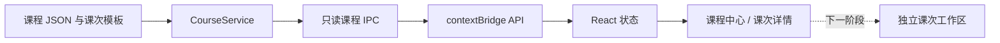

# RobotDog Studio 单片机课程框架架构说明

更新日期：2026-08-06

状态：阶段零基线，随实现更新

关联计划：[单片机入门版课程框架详细实施计划](./mcu-course-framework-implementation-plan.md)

## 1. 当前实施范围

第一批切片只建设只读课程目录，不改变工作区 schema，也不创建课次练习。完成后应用具备：

- 从 `resources/courses/mcu-foundations` 读取课程和课次；
- 在单片机版显示课程中心、课次目标、步骤和硬件状态；
- 通过 Main IPC 按 course ID 和 lesson ID 查询，不接收 Renderer 传入的资源路径；
- 在开发模式显示 draft 课，打包版本只显示 published 课；
- 为下一阶段“一课一工程”保留 `templateId`、编辑范围和完成检查字段。

当前“开始学习”按钮明确显示为下一阶段能力，避免把尚未实现的工作区创建伪装成可用功能。

## 2. 数据流



### Main

`CourseService` 负责：

- 读取 catalog、course manifest 和 lesson manifest；
- 校验必要字段、稳定 ID、相对路径、课次顺序和前置课引用；
- 根据运行方式决定是否显示 draft 内容；
- 返回可安全传给 Renderer 的结构化课程数据。

首期不缓存课程，不建设旧版本运行时、内容哈希锁、规则引擎或学习证据系统。课程规模较小，启动时按需读取 JSON 更容易调试和维护。

### Preload 与 IPC

只读 API：

```text
listCourses()
getCourse(courseId)
getCourseLesson(courseId, lessonId)
```

课程 IPC 只在 `mcu-foundations` 注册。ID 由 Main 再校验；资源路径始终由 catalog 和 Main 推导。

### Renderer

单片机工作台新增“课程中心”标签并作为默认页。课程中心只负责浏览：

- 课程身份、受众、目标平台和课次数量；
- 有序课次、预计时间和硬件要求；
- 当前课次目标、步骤和待验证硬件警告；
- 不可点击的“开始学习（下一阶段）”说明。

当前项目选择器、工程代码、候选修改、编译、烧录和设置页保持原样。

## 3. 资源约定

```text
resources/courses/mcu-foundations/
├─ catalog.json
└─ ch32v203-foundations/
   ├─ course.json
   └─ lessons/
      ├─ studio-first-build.json
      ├─ c-files-and-functions.json
      └─ first-hardware-placeholder.json
```

- `courseId`、`lessonId` 和 `stepId` 使用小写 ASCII、数字和连字符。
- 整套课程只维护一个递增 `contentVersion`；Git 保存具体变更历史。
- manifest 不得包含脚本或绝对路径。
- draft 课用于开发期验证，打包版本不展示。
- `templateId` 在第一批切片中只描述后续目标，不触发工作区复制。

## 4. 必须保留的安全边界

以下边界直接关系到本机文件和硬件安全，不随项目规模缩减：

- Renderer 不能提交模板路径、编辑规则、Shell 命令或烧录命令；
- 课次可编辑范围不能扩大平台现有禁止范围；
- AI 修改继续进入候选区、预检、Diff 和人工确认；
- 烧录必须由用户点击确认，AI 和课程数据不能自动触发；
- 未经真机检查的硬件课必须显示待验证，不提供确定接线结论。

学习步骤勾选和回答不按防作弊或审计场景设计。

## 5. 失败行为

- 课程根资源读取失败：课程中心显示错误；普通 MCU 项目仍可使用。
- ID 或前置引用不合法：拒绝加载课程并返回可定位错误码。
- draft 课在打包环境被隐藏：不影响其他 published 课。
- Renderer 请求不存在的课程或课次：返回 `COURSE_NOT_FOUND` 或 `COURSE_LESSON_NOT_FOUND`。
- 下一阶段模板创建失败时应只清理本次未完成目录，不覆盖现有项目；本切片尚不执行模板创建。

## 6. 下一阶段接口落点

“开始学习”接入时：

1. `CourseService` 根据 lesson ID 解析已登记模板和权限；
2. `WorkspaceService` 接收 Main 生成的 `WorkspaceCreationSpec`；
3. 创建独立工作区并记录 course ID、lesson ID、contentVersion 和 attempt number；
4. 课程中心进入该工作区的“实验任务”页；
5. 进度仅保存步骤勾选、问题回答、最近编译/烧录状态和人工观察。

