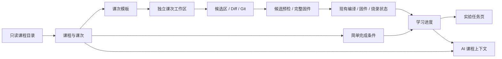

# RobotDog Studio 单片机入门版课程框架详细实施计划

更新日期：2026-08-06  
状态：待实施的权威计划  
上位决策：[双发行版教学改造总纲](./dual-edition-teaching-plan.md)  
需求来源：项目所有者提供的《RobotDog Studio 单片机入门版课程框架建设计划》

## 1. 本计划的目标与边界

本计划把单片机入门版从“一个通用实验工程”升级为“课程—课次—独立学习工程—实验步骤—学习进度—完成状态”的学习平台。该项目面向小范围教学和小批量量产，由个人长期维护，因此优先采用能直接解决问题的简单设计，不建设面向多租户、合规审计或大规模在线平台的基础设施。实施期间继续遵守以下边界：

- 课程系统只在 `mcu-foundations` 发行版启用，趣味巡线版不加载、不展示单片机课程资源。
- 两个发行版继续复用同一仓库、Main/Preload/Renderer、候选区、Git、编译、固件和烧录能力。
- 一课一次练习对应一个独立工作区，不把上一课的学生代码复制到下一课。
- Renderer 只能传稳定 ID、步骤勾选和人工回答，不能传模板路径、权限规则、检查脚本或工具命令。
- 课程扩展以新增经过校验的资源和模板为主，不为每一课在 React 页面中增加硬编码分支。
- `D:\RobotDog\EVT` 仅是开发期官方参考源；不修改该目录，正式应用也不依赖该绝对路径。
- 本阶段只要求两个无硬件示例课形成完整闭环；硬件课在真机验证前必须显示“待验证”，不能宣称现象已成立。
- AI 继续固定使用 `deepseek-v4-flash`，继续经过候选区、编译、Diff 和人工确认，不能自动烧录。

规模适配原则：

- 学习进度用于帮助学生继续学习，不作为考试、防作弊或合规审计记录。
- Git、编译、固件和烧录继续使用现有服务状态，不再为每个动作复制一套独立“证据链”。
- 课程资源只做基本 schema、路径和引用校验，不引入全量内容哈希锁、签名或长期多版本兼容系统。
- 服务按代码复杂度自然拆分；首期允许一个课程服务配合一个轻量进度存储，不预设四个独立服务。
- 自动化测试集中覆盖数据读取、工作区创建和安全关键路径；界面点击、真机烧录与硬件现象仍由项目所有者人工复核。

本轮轻量化修订摘要：

| 原计划 | 调整后 |
| --- | --- |
| 编译、Git、固件、烧录和人工确认分别形成证据对象 | 只保存步骤勾选、答案、最近编译/烧录状态和人工观察 |
| 证据绑定 Git commit、候选 ID、基线和产物哈希 | 不做绑定；界面明确这是学习进度，不是审计记录 |
| 课程、课次、模板、验收规则分别版本化 | 整套课程只使用一个递增 `contentVersion`，实际历史由 Git 保存 |
| 全量 SHA-256 课程锁和旧版本运行时 | 只校验 schema、相对路径、必要文件和模板引用，首期只携带当前课程 |
| 预设四个独立课程服务 | 首期采用 `CourseService + CourseProgressStore`，需要时再拆分 |
| 通用声明式验收引擎 | 采用少量固定完成检查，普通步骤由学生自行勾选 |
| 每个阶段完成全部门禁后才能进入下一阶段 | 阶段仍提供推荐顺序，但允许相邻阶段并行迭代，以可运行切片为交付单位 |
| 每次成功流程都保存完整截图、日志和产物信息 | 只在人工复核清单要求或出现问题时保存必要材料；硬件验证保留简明记录 |

## 2. 已核实的工程现状

### 2.1 可直接复用的能力

| 能力 | 当前实现 | 课程框架中的复用方式 |
| --- | --- | --- |
| 双发行身份 | `src/shared/edition.ts` | 仅在 `mcu-foundations` 注册课程 IPC 和页面入口 |
| 工作区与 Git | `WorkspaceService`、每工作区独立仓库 | 每次课次练习继续创建独立工作区和 Git 历史 |
| 候选修改 | `CandidateService`、`PatchPolicyService` | 读取课次生成的可信策略，保留隔离、预检、Diff、确认流程 |
| 多文件编辑 | 动态列出 `App/Src/**/*.c`、`App/Inc/**/*.h` | 根据课次模板和策略显示不同教学文件 |
| 候选预检 | `CandidateBuildService` | 编译课次 `App/Src` 中所有教学 C 文件，并附加课次检查结果 |
| 完整固件构建 | `FirmwareBuildService` | 将当前课次教学目录覆盖到受保护固件基线后构建 |
| 烧录保护 | WCH-Link 页面与固件产物身份校验 | 课程只读取可信烧录结果，不允许通过课程数据绕过确认 |
| AI 安全闭环 | `AgentSessionService`、Reasonix ACP、Main 权限复核 | 在现有提示词外注入可信课次上下文和学习进度 |
| 离线发行 | 双版 ZIP/NSIS 打包脚本 | 单片机包增加课程目录和课次模板，并检查引用文件是否齐全 |
| 快速人工验证 | `start-mcu-dev.cmd` | 课程框架开发阶段优先使用开发模式热更新，不反复打包 |

### 2.2 当前缺口

1. `WorkspaceService` 在构造时只接收一份 MCU 模板，不能按课次选择模板。
2. 工作区元数据 schema v2 只记录发行版和通用模板，没有课程、课次和尝试次数。
3. MCU 权限策略仍按发行版统一生成，无法为每课开放不同文件。
4. Renderer 只有工作区选择器，没有课程目录、课次详情和尝试列表。
5. MCU 默认页是“工程代码”，没有“实验任务”页。
6. 编译、固件和烧录状态存在于各服务快照中，但任务页尚不能读取并显示这些状态。
7. AI 只知道 MCU 通用规则，不知道当前课次、步骤、目标和验证状态。
8. 打包脚本只选择一份 MCU 通用模板，没有课程资源完整性检查。
9. 当前没有课次资源 schema、前置关系检查或课程完成判定逻辑。
10. 串口终端尚未形成可用于课程验收的正式能力，不能把串口观察写成已自动验证。

### 2.3 EVT 初步审查结论

`D:\RobotDog\EVT` 已确认存在，包含 CH32V20x 官方外设库、启动/链接文件、CH32V203C8T6 参考板原理图/PCB资料，以及 GPIO、EXTI、USART、TIM/PWM、ADC、DMA、I2C、SPI、IAP 等示例。

已抽查的示例包括：

- `EXAM/GPIO/GPIO_Toggle`：PA0 推挽输出，每 250 ms 翻转；
- `EXAM/USART/USART_Printf`：USART1 TX PA9，115200；
- `EXAM/TIM/PWM_Output`：TIM1 CH1 PA8 输出 PWM；
- `EXAM/EXTI/EXTI0`：PA0 下拉沿外部中断。

这些示例证明 SDK API 和初始化顺序有官方来源，但不能直接证明适用于机器狗硬件。当前 RobotDog 固件中 PA0 已作为 LED、PA1 作为按键、PA4 和其他引脚用于 CCD，USART3 PB10/PB11 用于开发命令/语音通信；固件清单仍将蓝牙最终绑定和 IAP 分区标为未确认。因此：

- PA0、PA1、PA4、PA8、PA9、PB10、PB11 等都必须进入硬件占用矩阵后再决定是否用于课程；
- 官方参考板现象不能直接改写为 RobotDog 板现象；
- 首批两个无硬件课可以立即建设；
- 第三个硬件课先以 `draft/unverified` 资源存在，只有通过第 8 节的真机门禁后才能改为 `published/verified`。

阶段零实施时应把完整审查结果单独写入 `docs/mcu-evt-source-audit.md`，记录 SDK 版本、来源文件、许可证提示、引脚/外设差异和适配决定。

## 3. 目标架构



### 3.1 课程资源目录

采用只读、直观、便于手工维护的资源结构：

```text
resources/
├─ courses/
│  └─ mcu-foundations/
│     ├─ catalog.json
│     └─ ch32v203-foundations/
│        ├─ course.json
│        └─ lessons/
│           ├─ studio-first-build.json
│           ├─ c-files-and-functions.json
│           └─ first-hardware-placeholder.json
└─ workspace-templates/
   └─ ch32v203-mcu-lessons/
      ├─ studio-first-build/
      ├─ c-files-and-functions/
      └─ first-hardware-placeholder/
```

约束：

- ID 使用小写 ASCII、数字和连字符；课程整体保留一个递增的 `contentVersion`，用于诊断和判断工作区创建时使用的课程内容。
- 课程资源只引用相对资源 ID，不引用开发机绝对路径。
- 课次模板是运行时可直接复制的完整学生工作区模板；公共基础工程与差异合成只能发生在开发/打包阶段。
- 加载和打包时检查 manifest、必要文件和引用模板是否存在，并继续拒绝路径穿越和符号链接；不为每个课程文件维护 SHA-256 锁。
- 修改已发布课次时直接递增 `contentVersion` 并保留 Git 历史。旧练习已经复制了代码模板，可继续打开；首期不要求旧练习重新呈现当时的完整课程文字。

### 3.2 课程与课次数据模型

课程 manifest 至少包含：

```text
schemaVersion
courseId / contentVersion
title / summary / audience / objectives
status: draft | published
boardScope
lessonOrder[]
sourceAttribution[]
```

课次 manifest 至少包含：

```text
schemaVersion
courseId / lessonId
title / summary / objectives[] / prerequisites[]
estimatedMinutes
hardware: none | optional | required
verification: not-required | pending-hardware-check | hardware-checked
expectedObservation
templateId
editableGlobs[] / readableFiles[] / deniedGlobs[]
steps[]
completionChecks[]
reflectionQuestions[]
aiContext
status: draft | published
```

课次步骤使用稳定 `stepId`，类型限定为：

- `read`：阅读和确认；
- `edit`：修改指定教学文件；
- `candidate-build`：候选源码预检；
- `review-apply`：Diff 审查并保存 Git 检查点；
- `firmware-build`：生成当前工程对应固件；
- `flash`：人工触发烧录；
- `serial-observation`：串口观察，首期只允许人工确认；
- `hardware-observation`：硬件现象，必须人工确认并标注验证级别；
- `question`：回答思考题；
- `summary`：阅读本课总结。

课程资源不允许包含任意 Shell 或 JavaScript。首期完成检查只使用少量固定类型：

- 文件存在/缺失；
- 候选预检通过；
- 完整固件构建通过；
- 烧录操作成功；
- 人工观察已确认；
- 思考题已回答。

课程完成以步骤勾选为主，上述检查只提供状态提示和少量必要门槛；不逐字比较标准答案，不允许课程资源自行执行代码。

### 3.3 工作区身份升级

把工作区元数据从 schema v2 升级到 v3，增加足以识别课次练习的少量字段：

```text
workspacePurpose: fun-project | mcu-sandbox | mcu-lesson-attempt
templateId
courseBinding?: {
  courseId
  lessonId
  contentVersion
  attemptNumber
}
```

迁移规则：

- 趣味巡线 v2 工作区迁移为 `fun-project`，现有项目、Git、候选和历史不变。
- 现有 MCU v2 工作区迁移为 `mcu-sandbox`，不强行关联任何示例课。
- 只有课程目录中存在的课次才能创建 `mcu-lesson-attempt`。
- 工作区创建后不改变其课程、课次和模板身份；`contentVersion` 只用于诊断，不承担审计用途。
- Main 根据 lesson ID 选择模板并继续执行现有路径和权限校验，不接受 Renderer 传入模板路径。
- 迁移采用一次性备份和写入；失败时保留原工作区并报告，不建设通用迁移框架。

### 3.4 学习进度与运行状态

每个课程工作区根目录新增轻量 `course-progress.json`，位于 `project/` 外，因此不进入学生代码 Diff 和 Git。建议 schema：

```text
schemaVersion
workspaceId
status: not-started | in-progress | needs-attention | completed
currentStepId
steps: [{ stepId, completed, completedAt? }]
answers: [{ questionId, text, submittedAt }]
lastBuild: { status, checkedAt? }
lastFlash: { status, checkedAt? }
manualObservations: [{ stepId, confirmed, confirmedAt? }]
startedAt / updatedAt / completedAt?
```

简化规则：

- 学生可以勾选阅读、编辑、总结等普通步骤；编译、固件和烧录状态从现有服务的最近一次结果同步为简单状态和时间。
- 不为编译、Git 提交、固件、烧录和人工确认分别建立 evidence 对象，也不绑定 Git commit、候选 ID或产物哈希。
- 代码再次修改后无需自动追溯并作废历史完成项；任务页明确标注“完成记录仅供学习参考”，学生可主动重新编译。
- 对确实依赖操作结果的步骤，只检查最近一次编译/烧录是否成功；硬件现象仍由学生或教师人工确认。
- 进度文件写入失败时报告错误并保留可用旧文件；损坏时允许备份后重建，由界面告知进度可能丢失。
- 课程总进度直接按各课最新一次练习的完成比例聚合，不建立额外数据库。

### 3.5 Main 服务与 IPC 边界

首期新增模块建议：

- `CourseService`：加载和校验课程、解析课次模板与权限、生成 AI 需要的课次摘要。
- `CourseProgressStore`：保存步骤勾选、答案、最近编译/烧录状态并计算完成比例。

如果实现后单个模块明显过大，再按目录读取、进度或 AI 上下文拆分；计划不预先要求四个独立服务和复杂事件总线。

对现有服务的改造：

- `WorkspaceService` 接收 Main 解析后的 `WorkspaceCreationSpec`，不再在构造时绑定唯一 MCU 模板。
- `CandidateService` 和 `PatchPolicyService` 继续读取项目内由 Main 生成的策略，但策略来自课次 manifest 的安全交集。
- `CandidateBuildService` 和 `FirmwareBuildService` 继续保持现有职责，课程页只读取其最近结果。
- WCH-Link/更新服务保持现有职责，课程页记录最近一次成功或失败及时间；模拟烧录仍必须在界面上明确标识。
- `AgentSessionService` 在每轮开始前读取当前课次摘要和学习进度。

新增 API 只接受 ID/回答，不接受文件系统路径：

```text
listCourses()
getCourse(courseId)
getLesson(courseId, lessonId)
listLessonAttempts(courseId, lessonId)
createLessonAttempt(courseId, lessonId, studentDisplayName)
getCourseProgress(workspaceId)
acknowledgeCourseStep(workspaceId, stepId)
submitCourseAnswer(workspaceId, questionId, answer)
confirmCourseObservation(workspaceId, stepId, observationKind)
```

所有 IPC 做基本 schema、ID、文本长度和 edition 检查。课程 API 不在趣味巡线版注册，或统一返回 `COURSES_NOT_AVAILABLE_IN_EDITION`。涉及模板路径和写文件的接口仍由 Main 决定目标；普通进度勾选不按恶意客户端威胁模型设计。

### 3.6 Renderer 信息架构

单片机版增加两个层次：

1. **课程中心**：课程列表、课次列表、状态、前置课、预计时间、硬件要求、继续学习、新建练习；
2. **课次工作台**：默认打开“实验任务”，再进入工程代码、编译与问题、修改确认、烧录与运行、程序资源、设置。

第一阶段采用清晰列表和详情页，不做复杂地图。导航使用稳定 route ID，不继续用中文标签字符串判断页面。推荐 MCU 工作台顺序：

```text
实验任务 → 工程代码 → 编译与问题 → 修改确认 → 烧录与运行 → 程序资源 → 设置
```

串口终端只有在正式串口服务具备后才成为可点击目标；此前课程页显示“当前版本尚未提供自动串口验收”，不得放置伪终端。

### 3.7 AI 课程上下文

Main 为每轮 AI 请求生成结构化上下文，包含：

- 当前课程、课次和模板 ID；
- 本课目标、当前步骤、已完成步骤、下一步；
- 允许编辑和只读文件；
- 硬件要求、课程发布状态、预期现象及其是否已真机验证；
- 最近编译、烧录和人工观察状态；
- 本课允许的提示层级与禁止直接给出的内容。

上下文由 Main 从课程资源和进度文件生成，设置合理字符上限。学生消息不能覆盖可编辑范围和烧录确认规则。AI 可以解释和给提示；只有学生明确要求修改时才进入候选区。课程资源不包含完整参考答案，避免提示词直接泄露答案。

### 3.8 内容更新与打包策略

- 整套课程只维护一个递增 `contentVersion`，Git 提供实际变更历史；不分别维护课程、课次、模板和验收规则版本。
- 更新课程时可直接修改当前资源并递增 `contentVersion`。旧工作区代码不受影响；旧课程文字按当前版本展示并提示“内容可能已更新”。
- 不建设旧课程版本运行时、自动升级器或资源签名系统。若未来确实要向大量外部学校长期分发，再单独评估这些能力。
- 开发/打包前运行 `scripts/validate-mcu-courses.mjs`，检查 JSON schema、相对路径、模板和必要文件是否齐全，不生成全量哈希锁。
- 单片机包只包含当前 catalog 引用的课程与模板；趣味包排除这些资源。
- `draft` 课默认仅在开发模式显示；正式包只显示 `published` 课。硬件课发布前仍需项目所有者完成一次真机验证并将状态改为 `hardware-checked`。
- 打包后做一次离线打开、创建课程工作区和构建检查；正式运行不访问 `D:\RobotDog\EVT`。

## 4. 分阶段详细实施步骤

各阶段给出推荐实施顺序，但不作为严格瀑布门禁。相邻阶段可以围绕同一可运行切片交叉迭代；进入依赖后续数据结构的工作前，先稳定相关 schema 和接口。开发期使用 `start-mcu-dev.cmd` 验证，只在阶段里程碑和正式交付前重新生成安装包。

### 阶段零：现状审查与设计冻结

目标：把本计划中的初步判断转成可复查的工程事实，不进行大规模重构。

实施步骤：

- [ ] 建立 `docs/mcu-course-framework-architecture.md`，记录数据流、模块职责、关键安全边界和失败恢复。
- [ ] 建立 `docs/mcu-evt-source-audit.md`，记录 EVT 版本/目录、示例来源、许可证提示和不得修改原则。
- [ ] 从当前固件 `app_hal.h`、原理图和实物建立引脚/外设占用矩阵，至少覆盖 LED、按键、CCD、舵机 PWM、USART1/2/3、SWD/WCH-Link 和 IAP。
- [ ] 对 GPIO_Toggle、USART_Printf、PWM_Output、EXTI0 及候选硬件课相关示例逐一记录芯片、引脚、时钟、初始化顺序和与当前基线的差异。
- [ ] 核实当前 `WorkspaceService`、候选区、完整固件 overlay、烧录回执、模拟状态和打包资源路径。
- [ ] 冻结课程/课次/模板/进度 schema 草案、ID 规则、单一 `contentVersion` 和简单 completion check 类型。
- [ ] 决定第三个示例课只保留占位，还是选择经过所有者确认的 LED/GPIO/UART 方向。
- [ ] 记录旧 MCU 通用工作区的迁移策略和回滚步骤。

自动化验证：新增正常/缺字段 schema fixture 和路径安全测试，不触碰现有工作区。

人工复核：项目所有者确认硬件占用矩阵、第三课方向和所有“已确认/未确认”标记。

退出条件：架构说明、EVT 审查和 schema 决策均可单独评审；没有未说明的硬件假设。

### 阶段一：课程目录与课次框架

目标：应用能从独立资源稳定加载并展示课程，但暂不创建课次工程。

实施步骤：

- [ ] 在 `src/shared` 定义课程摘要、课次详情、硬件要求、发布状态和资源诊断类型。
- [ ] 实现 `CourseService` 及 Zod schema，校验 ID、内容版本、顺序、重复 ID、前置课引用和必要字段。
- [ ] 课程资源读取失败时显示课程系统不可用和可定位的错误信息；不要求首期实现单课故障隔离器。
- [ ] 新增三个示例课 manifest；第三课明确标记 `draft`、`manual-required` 或 `unverified`。
- [ ] 增加课程 IPC/Preload API，Main 根据 edition 决定是否提供。
- [ ] 在单片机版增加课程中心入口、课程列表、课次详情和空状态；趣味版保持现状。
- [ ] 展示预计时间、硬件要求、前置课、发布状态和“尚未创建工程”。
- [ ] 前置课采用软门禁：未完成时提示并要求确认跳过，但允许大学生直接练习自包含课次。
- [ ] 将 UI 文案全部从课程资源读取，页面组件不硬编码具体课名和步骤。

自动化验证：manifest 正常/缺字段/重复 ID/无效引用测试；edition 隔离测试；Renderer 列表和状态测试。

人工复核：开发模式点击课程中心，检查三课顺序、长文本、空状态、错误资源提示和趣味版隔离。

退出条件：课程可发现、可展示、可诊断，尚不能通过 Renderer 指定任意模板。

### 阶段二：一课一工程与课程身份

目标：从选定课次的已登记模板创建独立工作区，支持继续和重复练习。

实施步骤：

- [ ] 将工作区 schema 升级到 v3，实现一次性 v2→v3 非破坏迁移并保留旧元数据备份。
- [ ] 现有 MCU 项目标记为 `mcu-sandbox`；现有趣味项目保持 `fun-project`。
- [ ] 引入 `WorkspaceCreationSpec`，由 Main 根据 lesson ID 解析模板、策略和当前 `contentVersion`。
- [ ] 改造 `WorkspaceService`，保留普通项目入口，同时新增 `createLessonAttempt`。
- [ ] 为每课建立独立模板目录；课 0 由当前通用模板迁入，课 1 使用不同多文件模板，课 2 使用明确占位模板。
- [ ] 课次 manifest 的 editable/readable/denied 规则与平台全局禁止规则取安全交集，再写入受管 `robotdog.project.json`。
- [ ] 模板复制前检查目录存在、必要文件、符号链接和路径安全；失败时清理本次未完成目录。
- [ ] 生成单调递增 `attemptNumber`，新练习不覆盖旧工作区。
- [ ] “重新开始”实现为创建新尝试并保留旧尝试；不提供静默原地清空。
- [ ] 课程中心显示继续上次、查看所有尝试、新建练习；普通 MCU sandbox 仍可使用但不显示课程完成状态。
- [ ] Main 保证课程只选择 catalog 中登记的模板，候选区继续使用现有工作区身份和权限校验。

自动化验证：元数据迁移、模板缺失、路径越界、不同课模板、重复尝试、候选权限和 Git 隔离测试。

人工复核：分别创建课 0/课 1 两次，确认文件结构不同、旧尝试保留、重启后继续入口正确。

退出条件：一课一工程成立，课程入口不能指定任意模板路径或扩大编辑权限。

### 阶段三：实验任务页、进度与完成判定

目标：把学习流程变成可保存、易理解的任务清单，并复用现有编译和烧录结果。

实施步骤：

- [ ] 实现 `CourseProgressStore`，保存步骤勾选、问题答案、人工观察以及最近编译/烧录状态。
- [ ] 实现少量固定 completion check，不建设通用规则引擎或证据注册表。
- [ ] 为课程工作区初始化所有 step 状态，默认进入第一项未完成步骤。
- [ ] MCU 工作台新增“实验任务”并作为课程工作区默认页；sandbox 仍默认工程代码。
- [ ] 任务页展示目标、步骤、完成比例、最近操作状态、硬件要求、预期现象、下一步按钮、总结和问题。
- [ ] 使用 route ID 统一跳转到代码、编译、Diff、烧录和资源页，移除依赖中文标签的跨页控制。
- [ ] 从候选预检、完整固件和烧录服务读取最近一次结果，保存 `status + checkedAt`；不复制提交号、候选 ID或产物哈希。
- [ ] 阅读、编辑、Diff、总结等步骤允许学生自行勾选；问题回答只检查非空和合理长度。
- [ ] 对明确要求构建或烧录的课次，最近一次相关操作成功才允许整课标记完成；普通步骤不做防作弊设计。
- [ ] 任务页注明进度记录仅供学习参考，代码修改后不会自动回滚已勾选步骤，建议学生按需重新编译。
- [ ] 未提供正式串口终端前，串口步骤显示不可用或由学生人工确认，不能显示为自动通过。
- [ ] 提供尝试状态聚合：未开始、进行中、需处理、已完成，以及完成时间。

自动化验证：进度重启持久化、写入失败、损坏后备份重建、最近编译/烧录状态、完成条件和进度不进入 Git Diff 测试。

人工复核：按课 0 步骤来回跳转、故意编译失败后修复、重启应用，核对勾选和最近状态。

退出条件：任务页能够准确回答“做到哪里、下一步是什么、最近一次关键操作是否成功”。

### 阶段四：AI 课程上下文

目标：AI 围绕当前课次和当前步骤教学，不越权、不虚构硬件结果。

实施步骤：

- [ ] 在 `CourseService` 中生成课程上下文；若后续逻辑明显膨胀，再拆出 `CourseContextService`。
- [ ] 为修改、代码解释、编译诊断和总结四类请求生成相应上下文切片，避免无关内容占用模型上下文。
- [ ] 上下文包含课程发布/硬件验证状态，第三课为 draft 时 AI 必须明确说明待验证。
- [ ] 把课次上下文注入 `AgentSessionService` 的普通修改、选中代码解释、诊断解释和修复流程。
- [ ] 更新 MCU 提示词版本，要求先提示、学生明确要求后再修改，不直接给整课最终答案。
- [ ] 课次可编辑范围只用于解释；真正修改权限仍由 `PatchPolicyService` 和 Main 二次校验。
- [ ] AI 回答不自动勾选课程步骤或伪造编译、烧录和硬件观察状态。
- [ ] 保持 `deepseek-v4-flash` 唯一模型和现有 Reasonix 工作模式选择。
- [ ] 对上下文做合理长度上限和基本文本清理。

自动化验证：不同课次上下文隔离、当前步骤、draft 提示、权限不扩大、AI 不自动烧录、提示词版本和模型锁定测试。

人工复核：在课 0/课 1询问相同问题，确认回答结合本课目标且不混课；在课 2询问硬件现象，确认 AI 不声称已观察。

退出条件：AI 能正确解释当前课程状态，但不能改变课程身份、编辑权限或烧录确认流程。

### 阶段五：三个示例课闭环

目标：用少量临时课程证明框架可扩展，而不是提前冻结最终课程内容。

#### 示例课 0：认识 Studio 与第一次编译

- 模板：当前通用 `experiment.c/.h` 的课程化版本。
- 硬件：不需要。
- 建议步骤：阅读工程入口 → 修改简单变量 → 候选预检 → 制造并修复一次语法错误 → Diff 保存 → 完整固件构建 → 查看 ELF/HEX/BIN/MAP 与资源 → 回答“编译与烧录有什么区别”。
- 完成检查：学生勾选必要步骤、候选预检通过、完整固件构建通过、问题已回答。
- 明确不要求：真实烧录和硬件现象。

#### 示例课 1：源文件、头文件与函数

- 模板：至少包含 `experiment.c/.h` 和一个独立教学模块，例如 `number_tools.c/.h`；与课 0 模板不同。
- 硬件：不需要。
- 建议步骤：阅读声明/定义 → 补全函数声明 → 实现带参数和返回值的函数 → 在 experiment 中调用 → 修复一次链接/声明问题 → Diff 保存 → 构建 → 总结头文件作用。
- 完成检查：必要文件存在、两个 C 单元均编译、完整固件构建通过、问题已回答。
- 不逐字比较函数实现，以真实编译结果和学生总结为主。

#### 示例课 2：第一个硬件实验占位课

- 初始状态：`draft + pending-hardware-check`。
- 方向选择：阶段零在 LED/GPIO、UART 输出、按键等方向中选择；未经引脚矩阵和真机确认不得定稿。
- 模板：可用于验证课程创建、硬件警告、烧录入口和人工观察记录，但页面和 AI 均显示待验证。
- 发布升级：完成阶段六硬件检查后，更新状态为 `published + hardware-checked`，同时递增课程 `contentVersion`。

共同实施步骤：

- [ ] 为每课写 manifest、独立模板、来源记录、权限和必要的完成检查 fixture。
- [ ] 在开发模式完成选择→创建→任务→编辑→编译→诊断→AI→Diff→保存→固件→可选烧录→完成记录。
- [ ] 记录课程文字和代码仍为示例状态，便于所有者后续逐课替换。
- [ ] 验证增加第四课只需新增资源/模板和少量注册数据，不改核心页面流程。

自动化验证：两课无硬件端到端服务测试；第三课未验证状态显示测试。

人工复核：所有界面点击由项目所有者完成；出现问题时保存对应截图和日志，不要求每次成功流程都归档全套截图。

退出条件：两个无硬件课完整完成；硬件课能够安全创建且诚实表达验证状态。

### 阶段六：新增课程、模板和硬件检查流程

目标：建立后续逐课扩展的简明清单，避免把未经真机验证的硬件现象作为正式课程发布。

实施步骤：

- [ ] 新建 `docs/mcu-lesson-authoring-and-hardware-validation.md`，提供课程作者清单和模板骨架。
- [ ] 从 EVT 选择官方示例并记录精确相对路径、文件版本、版权说明和使用的 API。
- [ ] 核对目标芯片、机器狗板原理图、实物、引脚复用、时钟、调试口、运动风险和供电。
- [ ] 将官方示例转换为独立教学模板，不复制整个 EVT，不让学生修改启动/链接/Bootloader。
- [ ] 运行课程资源校验、候选预检、完整固件构建、程序资源阈值和打包后离线构建。
- [ ] 由项目所有者执行 WCH-Link/目标下载方式烧录、复位、现象观察、异常恢复和物理安全验证。
- [ ] 在课程检查记录中保存硬件型号、接线说明、测试版本、实际现象、问题和验证日期；照片或视频仅在现象难以文字说明时保留。
- [ ] 对必要完成检查至少验证一个正确示例和一个明显错误示例，避免误导学生。
- [ ] 关键现象、复位和异常恢复通过后，将 `verification` 改为 `hardware-checked`，递增 `contentVersion` 并发布。
- [ ] 更新开发交接文档、人工验收清单和单片机测试包。

自动化验证：课程 schema、引用文件齐全、正式包不显示 draft、趣味版不携带课程资源。

人工复核：驱动、接线、真实烧录、串口/硬件现象、异常恢复和卸载共存测试。

退出条件：新增课程有可重复的简明流程，正式硬件课有一份可读的真机检查记录。

## 5. 测试矩阵

### 5.1 开发阶段验证节奏

普通文案或课程资源修改先运行相关 schema 测试和开发模式点击检查；涉及 TypeScript、工作区、编译或打包代码时运行：

```powershell
npm run typecheck
npm test
npm run build
```

课程资源或课程界面变更额外运行：

```powershell
node scripts/validate-mcu-courses.mjs
npm run smoke:electron:mcu
```

不要求每个小提交都重复全量打包。完成一个阶段或准备交付测试版时，再运行趣味版 smoke，并生成所需的 ZIP/NSIS；正式发布前执行双发行版回归。

### 5.2 必须自动覆盖

- schema、重复 ID、无效引用和路径安全；
- v2→v3 一次性迁移与失败时保留原数据；
- 每课模板与权限选择、任意模板路径拒绝；
- 重复练习不覆盖，旧工作区仍可打开；
- 进度持久化、损坏后备份重建、最近编译/烧录状态；
- 模拟烧录与真实烧录的界面标识不混淆；
- AI 课次上下文、权限、Flash 模型锁定和未验证硬件措辞；
- MCU 包引用文件齐全与趣味包隔离。

### 5.3 必须由项目所有者人工复核

- 课程中心、课次详情、继续/新建练习、实验任务页和跨页导航的实际点击；
- 屏幕缩放、窗口尺寸、长中文文本、键盘操作和错误状态；
- 安装/便携运行、双版本共存、旧工作区迁移；
- WCH-Link 驱动、真实烧录、复位、串口和硬件现象；
- 接线错误、拔线、取消、错误目标、急停和物理断电恢复。

需要项目所有者人工复核时，开发交付说明应给出测试版本/提交、启动方式、必要前置条件、操作步骤和预期结果；只在相关功能需要时补充日志位置或截图要求。频繁 UI 修复优先使用 `start-mcu-dev.cmd`，不要求每轮重新打包。

## 6. 失败处理与兼容策略

- catalog 或课次资源不可读：显示课程系统不可用和具体资源名，普通 MCU sandbox 和趣味版仍可使用。
- 旧工作区的 `contentVersion` 与当前课程不同时：继续打开学生工程，并提示课程说明可能已经更新。
- 模板创建失败：清理本次未完成目录，不覆盖已有练习。
- 进度损坏：把损坏文件改名备份，经用户确认后重建空进度；学生工程和 Git 不受影响。
- 代码修改后：不自动撤销已完成步骤；任务页始终显示最近一次编译和烧录时间，供学生自行判断是否重试。
- AI 不可用：课程、手动编辑、编译、Diff 和进度仍可工作。
- 硬件不可用：无硬件课可完成；硬件课停留在等待人工验证，不伪造完成。
- 课程更新：递增 `contentVersion`，不覆盖学生工程，不自动复制学生代码到下一课。

## 7. 交付物与阶段映射

| 大纲交付物 | 计划阶段 |
| --- | --- |
| 课程框架设计说明 | 阶段零 |
| EVT SDK 目录审查记录 | 阶段零 |
| 课程目录和课次加载 | 阶段一 |
| 一课一模板、工作区身份 | 阶段二 |
| 实验任务页、课程进度 | 阶段三 |
| AI 课程上下文 | 阶段四 |
| 三个示例课程及模板 | 阶段五 |
| 模板和硬件检查流程 | 阶段六 |
| 自动化测试 | 每个阶段 |
| 人工验收清单 | 阶段三起持续更新，阶段六定稿 |
| 开发交接文档 | 每个里程碑更新，阶段六汇总 |
| 单片机 Windows 测试包 | 阶段六 |

## 8. 最终完成定义

课程框架阶段只有同时满足以下条件才可关闭：

- 单片机版从独立资源显示课程和有序课次，趣味版无回退；
- 用户可为课次创建、继续和重复独立练习，旧尝试不被覆盖；
- 工作区记录课程、课次、模板、内容版本和练习次数；
- 不同课次确实使用不同模板与权限；
- 课程工程默认进入实验任务页，步骤和下一步清晰；
- 进度重启后保留，并能显示最近一次编译、烧录及人工观察状态；
- 现有候选、Diff、Git、编译、固件和烧录安全闭环继续有效；
- AI 获得当前课程上下文，不混课、不越权、不虚构硬件结果；
- 两个无硬件示例课可以完成端到端流程；
- 一个硬件课框架能够安全创建，并在未真机验证时保持明确未验证状态；
- EVT 审查、来源和硬件差异有记录，正式应用不依赖 EVT 绝对路径；
- 打包后课程和模板可离线使用，catalog 引用的文件齐全；
- 后续新增普通课次主要通过新增 manifest、模板和测试 fixture 完成，不需要重写核心工作台。

## 9. 第一批实施切片

开始编码时建议把第一个可合并切片限定为：

1. 完成阶段零正式审查文档；
2. 加入 course/lesson schema、三个静态 manifest 和精简的 `CourseService`；
3. 暴露只读课程查询 IPC；
4. 单片机版显示课程中心和课次详情，但“开始学习”暂显示下一阶段提示；
5. 完成资源读取错误、无效引用和 edition 隔离测试；
6. 由项目所有者在开发模式完成课程列表人工点击复核。

这个切片不修改工作区 schema、不创建课程工程、不接入进度和 AI，能够先验证课程资源边界，符合“先建设课程系统、审查完成前不进行大规模重构”的原则。
