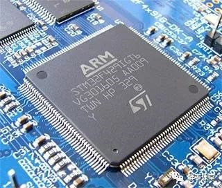

## 源代码是什么 {#source-code}

源代码是人可以阅读和修改的程序文本。当前课次中，主要练习文件位于 `App` 目录；启动代码、链接脚本和厂商外设库属于完整固件工程，但不是本课的修改目标。

:::concept[源代码]
源代码描述程序应该做什么。芯片不能直接运行 C 源文件，必须先由工具链完成编译和链接。
:::

单片机通常以这种封装焊接在电路板上。图中器件仅作外观示意，并非本课程使用的 CH32V203；本课关注的是源代码如何变成芯片可执行的程序。

::code-target[打开实验代码]{path="App/Src/experiment.c" line="1"}

## 编译、生成程序与烧录 {#compile-build-flash}

这三个动作回答不同问题：

| 动作 | 它能说明什么 | 它不能说明什么 |
| --- | --- | --- |
| 候选预检 | 本次教学代码能否通过受控编译 | 完整固件一定可用 |
| 生成程序 | 完整工程能否生成 ELF、HEX、BIN、MAP | 程序已经进入开发板 |
| 烧录 | 程序已写入并完成工具校验 | 应用逻辑一定正确 |

:::pitfall[编译成功不等于已经烧录]
生成了程序文件，只说明电脑得到了芯片可以使用的程序。只有执行烧录，程序才会被写入开发板。
:::

## Studio 的学习流程 {#studio-workflow}

本课使用以下顺序：

1. 阅读工程与实验入口；
2. 在安全草稿中完成小修改；
3. 检查候选代码；
4. 阅读 Diff 并保存修改；
5. 生成完整程序；
6. 用自己的话总结编译和烧录的区别。

:::tip
编译器一次给出很多错误时，先处理第一条有效错误。后面的错误经常只是第一处问题引起的连锁反应。
:::

::task-link[回到“找到实验入口”]{step="read-entry"}

## 怎样阅读构建结果 {#build-results}

成功生成程序后，Studio 会显示四类文件：

- `ELF`：包含程序、符号和调试信息；
- `HEX`：以文本形式记录待写入的数据；
- `BIN`：连续的二进制程序镜像；
- `MAP`：帮助查看函数和数据如何占用存储空间。

芯片的 Flash 用来保存程序，RAM 用来保存程序运行时的数据。构建摘要中的容量信息用于判断程序是否超过硬件范围。

::code-target[查看完整工程的构建入口]{path="CMakeLists.txt"}

## 本课小结 {#summary}

源代码需要经过编译和链接才能成为程序文件；生成程序和写入开发板是两个不同阶段。RobotDog Studio 把修改、检查、确认和构建分开，是为了让每一步的结果都清楚可见。

::task-link[回答编译与烧录问题]{step="reflect-build-flash"}
